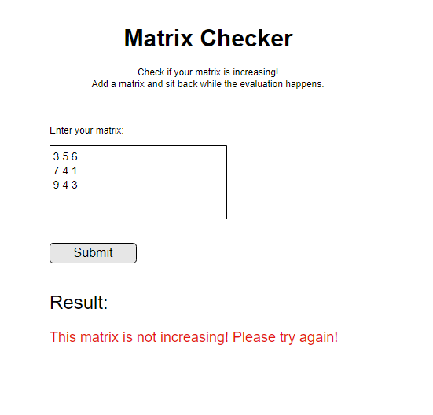

# Fulvipes Orientation Exam

Build a web app where you can check a matrix based on the given requirements.
The matrix that you add into the input field MUST be square matrix.

Square matrix: is a matrix with the same number of rows and columns. [wiki](https://en.wikipedia.org/wiki/Square_matrix)

```
this is a square matrix:
1 0 1
0 2 2
1 2 5

this is not a square matrix:
5 5 7 2 1
6 5 7 6 7
1 4 1 4 8
```

## Highlights

The checking page should look like this:



Increasing matrix: a matrix is said to be increasing matrix if for each column and row, the elements are in increasing order.

```
example for increasing matrix:
1 2 4
3 3 5
5 6 8

example for not increasing matrix
8 7 9
6 5 7
1 2 1
```

  - It has a frontend which:
    - renders main page with a form, which has an input text area
    - after submit renders the result / error to the same page


  - It has a backend which:
    - decides whether the received matrix meets the requirement
    - saves the valid matrix to a database with current date and time
    - handles errors
      - if the input text area is empty
      - if the matrix that was given is not square


More info is in the language specific description.

## Getting Started

 - Fork this repository under your own account
 - Clone the forked repository to your computer
 - Commit your progress frequently and with descriptive commit messages
 - All your answers and solutions should go in this repository

## What can I use?

 - You can use any resource online, but **work individually**
 - Instead of copy-pasting your answers and solutions, write them in your own words.

### Continue with your class' language:

 - [C#](javacs.md)
 - [Java](javacs.md)
 - [JavaScript](javascript.md)
