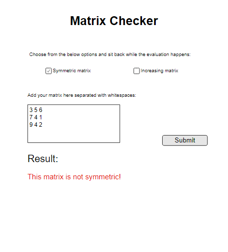

# Fulvipes Orientation Exam

## 1) Symmetric Matrix

You will create a web page which can check if the matrix is symmetric or not.

# Matrix Checker

## Frontend

- the **frontend** should have:
    - a heading with the title
    - nice intro text
    - radio buttons for the matrix validation options
    - text area for the matrix input
    - submit button for sending the matrix to backend to check

## Backend

- only a square matrix should be submitted in the input field,
  - otherwise the app should send an error message
- user can choose which validation type will the matrix ride through
- do the validation methods in backend
- in case the matrix is valid send a success message in 'Result' section
- in case the matrix is not valid send an error
- if success, save the matrix into a database with the following fields:
  - id, type, date, matrixNumbers

## Endpoints
- you should create these endpoints:

### GET `/`
- the endpoint should render an HTML displaying the main page

### POST `/matrix`
- this endpoint should be responsible for sending the matrix with the need of relevant validation type (symmetric or increasing)

### GET `/matrixes`
- this `REST` endpoint should query every matrix that were successfully saved and valid

## 2) Question time

### What is the difference between primary key and foreign key in database?

### What is the difference between unit and integration test?
